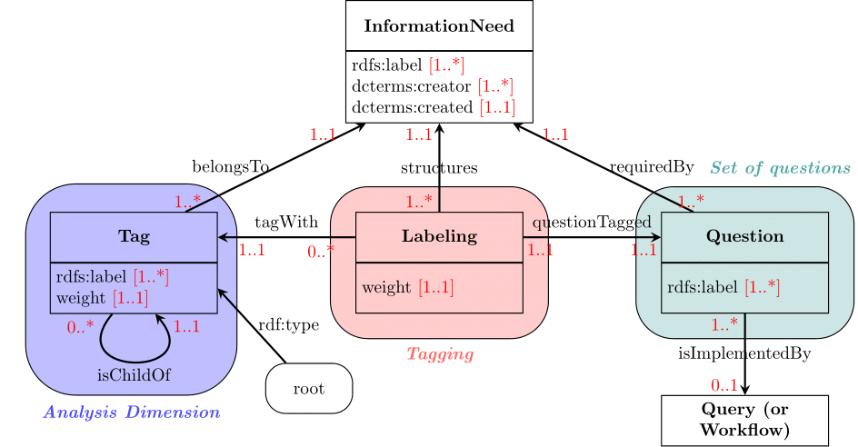
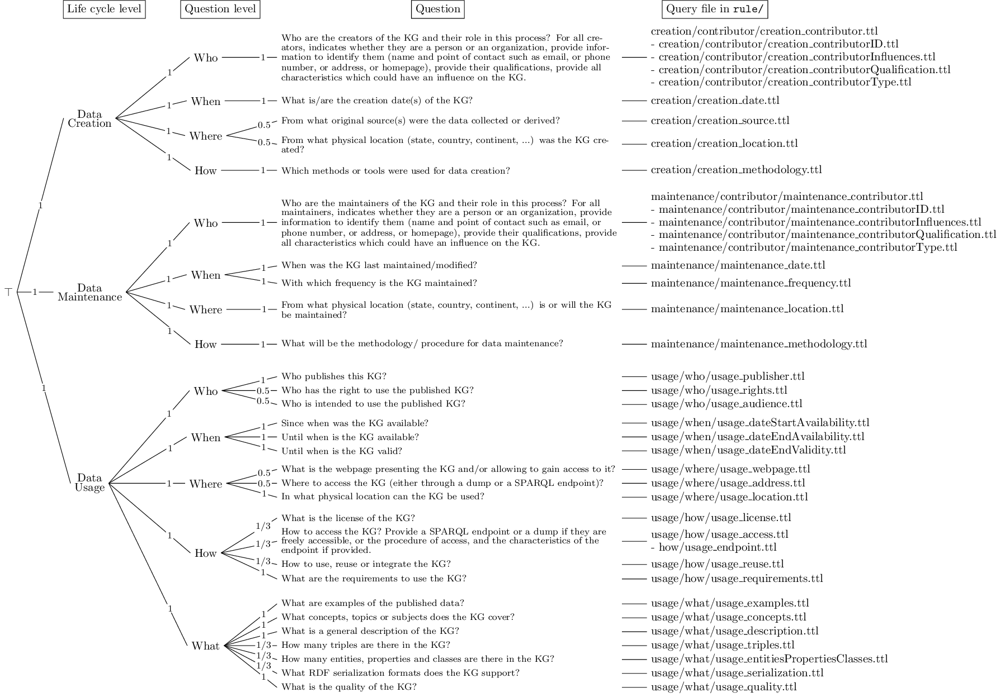

# KG accountability

This work is part of the [DeKalog project](https://dekalog.univ-nantes.fr).
This code is made to be used along with [IndeGx](https://github.com/Wimmics/dekalog), version v2.6.2 was used for these experiments.

- It provides a new set of rules to measure accountability of knowledge graphs in [rules/](https://github.com/Jendersen/KG_accountability/tree/main/rules).
- [information_need/](https://github.com/Jendersen/KG_accountability/tree/main/InformationNeed) provides the ontology SIN-O to describe information needs, and a first information need focused on accountability.
- [queries/](https://github.com/Jendersen/KG_accountability/tree/main/queries) contains queries to execute after running all rules on a given set of endpoints in order (i) to compute the score for the successions of queries and (ii) to obtain the different scores of accountability on each tag, and the global score.
- [catalogs/](https://github.com/Jendersen/KG_accountability/tree/main/catalogs) was taken from IndeGx. It is the catalog of endpoints used for our experiments.
- [results/](https://github.com/Jendersen/KG_accountability/tree/main/results) are the results of our experiments on the 27 preselected endpoints. Each result is divided into four files: *output-part1* and *output-part2* are the result of IndeGx with our rules ; *measures_workflow* are the result of the execution of the queries *q_measure_creator_who.rq*, *q_measure_maintenance_who.rq* and *q_measure_usage_how.rq* ; *measures_tags* are the result of the execution of the other queries. *results_summary.csv* provides the completeness score of KGs on each tag.

The queries *q_measure_creator_who.rq*, *q_measure_maintenance_who.rq*, and *q_measure_usage_how.rq* have to be executed first and their results be used for the execution of the other queries. All queries have to be executed on the output files in *results* with manual import of the two rdf files *liquid.ttl* and *sin.ttl*.

## Description of SIN-O: Structured Information Need Ontology

We define the ontology SIN-O as illustrated by the following figure. Hence, an *InformationNeed* is composed of a set of questions, pictured on the right, of an analysis dimension which is a set of structured tags, pictured on the left, and of links between these two sets represented by labelings, i.e. a tagging, pictured in the middle.

In addition, SHACL constraints have been added to the ontology in order to verify if the need is well-formed. Currently, these constraints are expressed considering only one need. In the figure, they are represented with the cardinalities in red (for unicity of weights, andl and unique tagging). Some other constraints check if a *Tag* either has a child or is used in a *Labeling* (leaf tagging and no orphan tag) and if each tag is a descendant of the *root* (the analysis dimension is a tree rooted at *root*).

Finally, to avoid defining inconsistent or unexpected analysis dimensions, we only allow a single *InformationNeed* to be associated with a *Tag*. Indeed there is only one structuring possible with this representation because the property *isChildOf* is only related with the tag and does not depend on the information need. As *Labeling* is associated with a tag, it can only belong to one analysis dimension. As a result, tags and questions cannot be used in several information needs, they must be copied in order to be reused. 

## Description of the Information Need about Accountability

The information need about accountability has been adapted from the [LiQuID metadata model](https://ceur-ws.org/Vol-2716/paper5.pdf), both its hierarchical structure and the questions illustrating each field of this structure. The information need we defined is illustrated in the following Figure.

